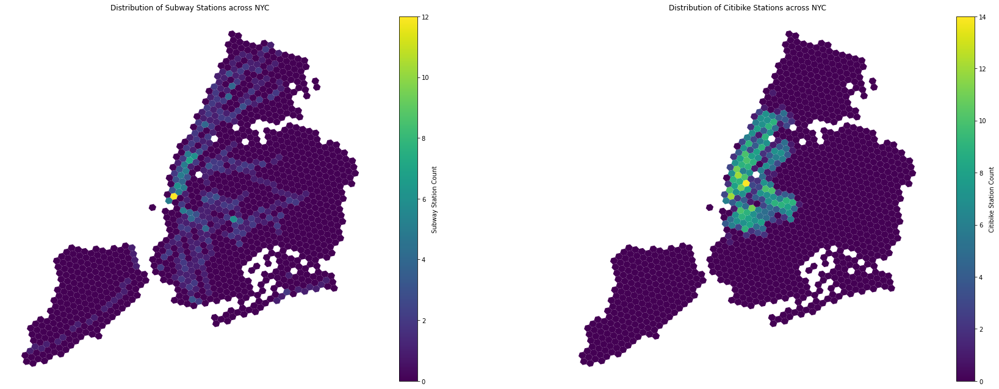
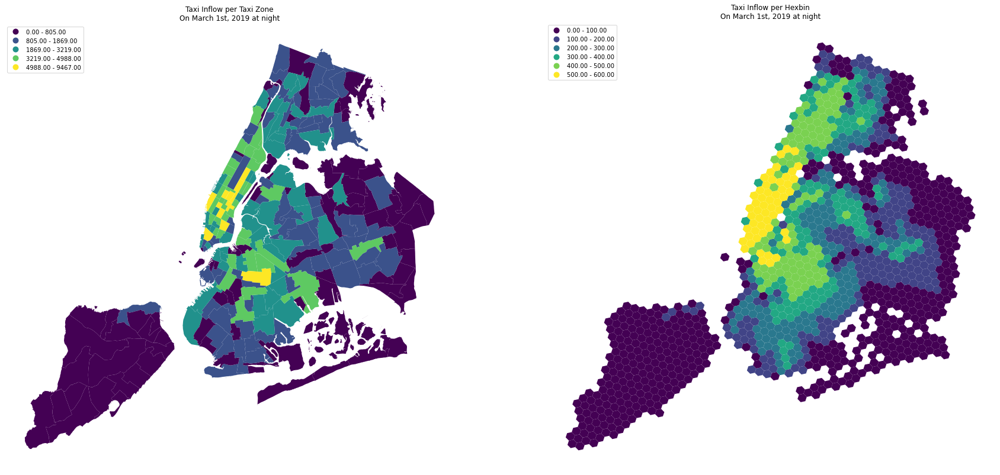

## Mapping Nighttime Urban Mobility in NYC and Charting COVID-19 Related Disruptions to Nightlife

**Links**: [Paper](nighttime_mobility_capstone.pdf), [Slide Deck](capstone_presentation.pdf)

**Abstract**: Our research aims to capture the vibrancy and expansiveness of New York City’s (NYC) nightlife landscape by interrogating how people access it: with Citibike, subways, or for-hire vehicles (FHV). We establish an understanding of the night-time transportation landscape to enable targeted recommendations around (increasing) transportation usage and mode choice that can ensure the continued survival of nightlife establishments throughout the city, the employment of people who work in them, and their accessibility and importance to their communities and patrons. Our initial research goal was to use multi-modal time series transportation data as an exploratory and advocacy tool to help local stakeholders in the nightlife industry (dance clubs, music venues, bars, and more) demonstrate their contribution to NYC’s citywide and hyper-local night-time economies. With the arrival of the COVID-19 pandemic, we expanded our research to examine how the night economy has been uniquely impacted by the crisis in the hopes of enabling policymakers to develop a nuanced understanding of the role of nightlife in the City and develop a uniquely targeted package of policies and aid that ensure its continued vitality. We built a baseline model of winter day and nighttime transportation with data from 2019, and expect to see significant variation given the arrival of the COVID-19 pandemic and related disruptions. We posit that the disruptions have severely affected night-life venues given their in-person nature and expect to see that reflected in the travel data for nightlife hotspots versus in the city as a whole. To empower future research we are sharing the complete dataset, consisting of aggregated venue data, travel data by mode, and more. Data analysts, city planners, venue owners, and others should be able to build on our work and better advocate for the needs of crucial players in NYC’s urban nightscape.

**Techniques**:

* Collection and aggregation
  * 
  * 

* Spatial Interpolation (disaggregation)
  * 
* Cluster Detection
  * 
  * 
